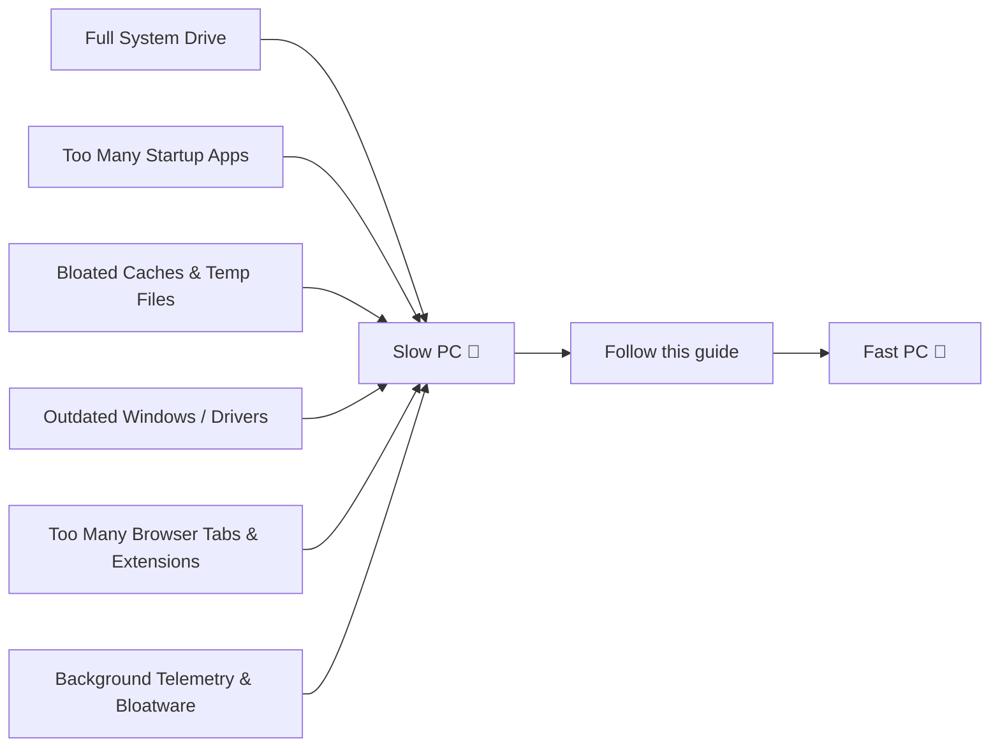

<div align="center">


# 🧹 Windows Cleanup & Speed-Up Guide

**A practical, no-nonsense guide to cleaning junk, freeing up disk space, and making your PC feel new again.**


</div>

---

## 📑 Table of Contents

- [Why Your PC Slows Down](#-why-your-pc-slows-down)
- [Quick Health Check](#-quick-health-check)
- [1. Free Up Disk Space](#1-%EF%B8%8F-free-up-disk-space)
- [2. Clean System & App Caches](#2-%EF%B8%8F-clean-system--app-caches)
- [3. Tame Startup & Background Apps](#3--tame-startup--background-apps)
- [4. Speed Up the System Itself](#4--speed-up-the-system-itself)
- [5. Keep It Fast — Maintenance Routine](#5--keep-it-fast--maintenance-routine)
- [Recommended Tools](#-recommended-tools)
- [Before / After Checklist](#-before--after-checklist)
- [FAQ](#-faq)

---

## 🐢 Why Your PC Slows Down



Over time, Windows accumulates temp files, Windows Update leftovers, duplicate downloads, forgotten apps, and background processes that quietly eat your CPU, RAM, and disk space. None of this is dangerous — it's just clutter. This guide removes it safely.

> ⚠️ **Before you start:** back up important files with **File History**, **OneDrive**, or an external drive. None of the steps below are destructive if followed correctly, but it's always good practice.

---

## 🩺 Quick Health Check

Open **PowerShell** (right-click Start → *Windows Terminal (Admin)* or *PowerShell (Admin)*) and run these to see your current state:

```powershell
# Check available disk space
Get-PSDrive -PSProvider FileSystem

# Check top processes by memory usage
Get-Process | Sort-Object WS -Descending | Select-Object -First 15 Name, @{N='MB';E={[math]::Round($_.WS/1MB)}}

# See Windows version and build
winver
```

| Symptom | Likely Cause |
|---|---|
| Fans spinning constantly | Runaway background process |
| Freezing / high disk usage in Task Manager | Low free RAM or a nearly-full system drive |
| Slow boot | Too many startup apps |
| Windows Search is slow or missing results | Index needs rebuilding |
| App launch delay | Cold cache / low disk space / disk fragmentation (HDD) |

---

## 1. 🗑️ Free Up Disk Space

Windows needs **at least 15–20% free space on C:** to run smoothly (for the page file, System Restore, and Windows Update).

### Built-in Storage tools
**Settings → System → Storage**

This shows a breakdown by category and lets you enable:
- **Storage Sense** — automatically deletes temp files and empties Recycle Bin on a schedule
- **Cleanup recommendations** — flags large/unused files, old Windows Update leftovers, and unused apps

### Find what's actually eating space
```powershell
# Find the 20 largest files on your C: drive
Get-ChildItem -Path C:\ -Recurse -ErrorAction SilentlyContinue -File |
  Sort-Object Length -Descending | Select-Object -First 20 FullName, @{N='MB';E={[math]::Round($_.Length/1MB,1)}}

# See folder sizes under your user profile, sorted
Get-ChildItem "$env:USERPROFILE" -Directory | ForEach-Object {
  $size = (Get-ChildItem $_.FullName -Recurse -ErrorAction SilentlyContinue | Measure-Object Length -Sum).Sum
  [PSCustomObject]@{ Folder = $_.Name; MB = [math]::Round($size/1MB,1) }
} | Sort-Object MB -Descending
```

### Common space hogs to check manually

| Location | What's there | Safe to clear? |
|---|---|---|
| `Downloads` folder | Installers, old zips | ✅ Yes, review first |
| `C:\Windows\Temp` and `%TEMP%` | Temporary system/app files | ✅ Yes (see §2) |
| `C:\Windows.old` | Leftover from a Windows upgrade | ✅ After 10 days, via Disk Cleanup |
| `C:\Windows\SoftwareDistribution\Download` | Old Windows Update files | ✅ Safe to clear (see §2) |
| Recycle Bin | Deleted files | ✅ Empty it |
| `OneDrive` / cloud folders | Synced files | ⚠️ Check sync status first |
| `C:\Windows\WinSxS` | Component store (Windows itself) | ❌ Don't delete manually — use `DISM` (see §4) |

---

## 2. 🧽 Clean System & App Caches

Caches speed things up short-term but can bloat over months/years of use.

### Disk Cleanup (built-in GUI)
Press `Win + R` → type `cleanmgr` → select `C:` → click **"Clean up system files"** → check:
- Temporary files
- Windows Update Cleanup
- Delivery Optimization Files
- Previous Windows installation(s) (`Windows.old`)
- Recycle Bin

### Or clear it via PowerShell
```powershell
# Clear user temp files (safe — apps will just rebuild what they need)
Remove-Item "$env:TEMP\*" -Recurse -Force -ErrorAction SilentlyContinue

# Clear system temp files
Remove-Item "C:\Windows\Temp\*" -Recurse -Force -ErrorAction SilentlyContinue

# Clear old Windows Update download cache
Stop-Service wuauserv
Remove-Item "C:\Windows\SoftwareDistribution\Download\*" -Recurse -Force -ErrorAction SilentlyContinue
Start-Service wuauserv

# Empty the Recycle Bin
Clear-RecycleBin -Force -ErrorAction SilentlyContinue
```

> 💡 **Tip:** Never manually delete anything inside `C:\Windows\WinSxS` or `C:\Windows\System32` — those are managed by Windows itself. Stick to `%TEMP%`, `Downloads`, and the Disk Cleanup tool.

### Reset browser & app caches (if things feel sluggish)
- **Edge / Chrome:** `Settings → Privacy → Clear browsing data → Cached images and files`
- **Windows Store apps:** `Settings → Apps → [app] → Advanced options → Reset`
- **Windows Search index:** rebuild it if search results feel stale (see §4)

---

## 3. 🚀 Tame Startup & Background Apps

Fewer things starting at login = faster boot and more free RAM immediately.

**Task Manager (`Ctrl + Shift + Esc`) → Startup apps tab**

- Disable anything you didn't intentionally install to auto-launch
- Sort by **"Startup impact"** and target the "High" entries first

### Check what's silently running in the background
```powershell
# List background apps with permission to run
Get-CimInstance Win32_Process | Sort-Object WorkingSetSize -Descending |
  Select-Object -First 15 Name, @{N='MB';E={[math]::Round($_.WorkingSetSize/1MB)}}
```

Also check **Settings → Apps → Startup** and **Settings → Privacy & Security → Background apps** to stop UWP/Store apps from running unattended.

---

## 4. ⚡ Speed Up the System Itself

| Action | How | Effect |
|---|---|---|
| **Update Windows** | Settings → Windows Update | Fixes known performance bugs and security holes |
| **Update drivers** | Settings → Windows Update → Optional updates, or manufacturer site | Fixes GPU/chipset-related slowdowns |
| **Rebuild Search index** | Settings → Search → Searching Windows → Advanced → *Rebuild* | Fixes slow/broken search |
| **Repair system files** | `sfc /scannow` (Admin CMD/PowerShell) | Fixes corrupted system files |
| **Repair the component store** | `DISM /Online /Cleanup-Image /RestoreHealth` | Fixes deeper Windows image issues |
| **Reduce visual effects** | Settings → System → About → Advanced system settings → Performance → *Adjust for best performance* | Snappier UI on older PCs |
| **Check for malware/adware** | Windows Security → Full scan, or **Malwarebytes** | Removes hidden CPU-hogging junk |
| **Defragment (HDD only)** or **TRIM (SSD)** | `Optimize-Volume -DriveLetter C -ReTrim` (SSD) / `-Defrag` (HDD) | Keeps storage responsive |
| **Disable unneeded visual/telemetry services** | `Settings → Privacy & Security` | Frees background CPU/network |

```powershell
# Run all three core repair/optimization commands (Admin PowerShell)
sfc /scannow
DISM /Online /Cleanup-Image /RestoreHealth
Optimize-Volume -DriveLetter C -ReTrim -Verbose   # SSD; use -Defrag for HDD
```

---

## 5. 🔁 Keep It Fast — Maintenance Routine

```mermaid
gantt
    title Suggested Windows Maintenance Cadence
    dateFormat  X
    axisFormat %s
    section Weekly
    Empty Recycle Bin & Downloads :0, 1
    section Monthly
    Disk Cleanup + SFC scan       :1, 2
    Review Startup apps           :2, 3
    section Quarterly
    Full storage audit            :3, 4
    Update Windows + drivers + apps :4, 5
```



- ✅ **Weekly:** clear Downloads, empty Recycle Bin, restart your PC (a full restart, not just sleep)
- ✅ **Monthly:** run Disk Cleanup, `sfc /scannow`, review Startup apps in Task Manager
- ✅ **Quarterly:** audit large files, uninstall unused apps, update Windows/drivers/apps

---

## 🛠️ Recommended Tools

| Tool | Purpose | Free? |
|---|---|---|
| **Disk Cleanup / Storage Sense** (built-in) | Clear temp files & system leftovers | ✅ |
| **Task Manager** (built-in) | Find resource-hungry processes & startup apps | ✅ |
| **WinDirStat** | Visual disk space explorer | ✅ |
| **Bulk Crap Uninstaller (BCU)** | Fully uninstall apps + leftovers | ✅ |
| **Malwarebytes** | Adware/malware scan | ✅ (scan) |
| **CCleaner** | All-in-one cleanup suite | ✅ / 💰 |

> Avoid random "PC speed booster" or "registry cleaner" apps from pop-up ads — many are themselves adware, and aggressive registry cleaners can break things. Stick to well-known, reviewed tools.

---

## ✅ Before / After Checklist

- [ ] Backed up via File History / OneDrive / external drive
- [ ] Freed up disk space (≥ 15–20% free on C:)
- [ ] Cleared temp files, Windows Update cache & Recycle Bin
- [ ] Trimmed Startup apps
- [ ] Updated Windows, drivers & all apps
- [ ] Ran `sfc /scannow` and `DISM /RestoreHealth`
- [ ] Rebuilt the Search index
- [ ] Restarted the PC

---

## ❓ FAQ

<details>
<summary><strong>Will clearing caches delete my passwords or files?</strong></summary>
No. Caches and temp files are regenerated automatically by apps. Your documents, photos, and saved passwords (Credential Manager, browser password manager) are untouched.
</details>

<details>
<summary><strong>My PC is still slow after all this — what now?</strong></summary>
Open <code>Task Manager → Performance</code> and check whether CPU, RAM, or Disk is pegged at 100% at idle. A disk stuck at 100% usually points to a failing HDD, a runaway service, or too little RAM for your workload — in which case a hardware upgrade (more RAM or an SSD) may be the real fix.
</details>

<details>
<summary><strong>Is it safe to disable Windows services I don't recognize?</strong></summary>
Only disable startup apps and background apps as shown in this guide. Avoid disabling Windows services directly (via <code>services.msc</code>) unless you know exactly what a service does — some look "safe" to disable but are tied to security, updates, or drivers.
</details>

---

<div align="center">

Made with ☕ for people whose laptop fans sound like a jet engine.

⭐ **If this helped, consider starring the repo!**

</div>
